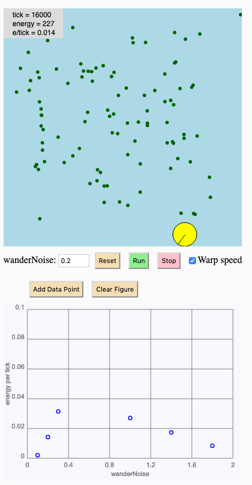

# MCB 419 - HW03 - wandering
due Tue Feb 5, 2019, 9:00 PM  
email p5js project link to mcb419@gmail.com

## Introduction
This assignment builds on last week's homework in which 
a bot collected food pellets as it moved in a circular path. 
This week you will replace the circular movement with a wandering behavior.
You will add boundary conditions so that the bot can't move past the
edges of the arena.
The goal of the assignment is to determine how the amount of noise 
in the bot's trajectory influences foraging efficiency.
Foraging efficiency will be measured as the average amount of energy collected
per unit time.

## Specifications
The arena size, pellet count, and most bot specs are the same as last week.

New features that have been added for you:
- there is a new _bot property_ called 'wanderNoise', it is controlled by the value in the text box next to the Reset button
- there is a graph to display foraging efficiency (average energy per tick) versus wanderNoise
- there is a "warp speed" checkbox that makes things go faster  
(when checked, the simulation makes 100 calls to update per redraw)

New features that you need to implement:
- add new _bot parameter_ 'energyPerTick'; initialize to 0 on reset, 
- calculate energyPerTick at the end of every tick (= bot energy divided by elapsed time)
- add text display of energyPerTick in the upper left corner (below energy display)
- display energyPerTick to 3 decimal places (hint: use **nfc()** function)
- on each tick, before the bot position is updated, the bot heading should be _changed by_ a random amount between -wanderNoise and +wanderNoise  
(if wanderNoise is zero, the bot heading will not change)
- add code to prevent the edge of the bot from moving past the edge of the arena  
(hint: consider using the p5js **constrain()** function)

## Instructions
- **duplicate** the [HW03 template file](https://editor.p5js.org/mcb419/sketches/B54rII1QWt)
- **modify and debug code**
- **generate a plot** of foraging efficiency versus wanderNoise by testing different
values of wander noise; for each noise value, reset and run the simulation long enough for the energy per tick to stabilize, then and stop and use the "add data point" button to add a data point to the graph
- **answer the questions** in the index.html file  
- **SAVE YOUR PROJECT in the p5js editor (this step is important)!**  
- **submit the url** to mcb419@gmail.com with **subject: HW03**

## IMPORTANT NOTE:
Saving your project will not save the data points on the graph. If you reload the simulation, your data points will be cleared.

## -- End of assignment --