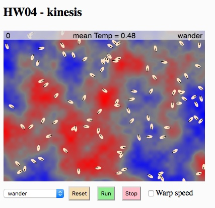

# MCB 419 - HW04 - kinesis
due Tue Feb 12, 2019, 9:00 PM  
email p5js project link to mcb419@gmail.com

## Introduction
This assignment explores different kinesis strategies. 
The goal is to understand how different stragegies influence the distribution of agents in a non-uniform environment.

The red/blue pattern below represents some physical parameter of the environment
that varies across space. 
It could represent nutrient density, light intensity, temperature, pH, etc.
For convenience, we will refer to it as temperature, and interpret the red regions as hot and the blue regions as cold.
The maximum temperature is 1 and the minimum temperature is 0.

There will be 100 agents in the environment. If they are randomly distributed, we expect
the mean temperature of the population to be about 0.5, averaged across all agents.
If the agents tend to congregate in warmer regions, then the mean temperature of the population will be higher. 

You will implement 3 different kinesis strategies:
orthokinesisPos, orthokinesisNeg, and run-tumble

## Specifications

Features that have been provided for you:
- world object generates and displays the temperature map
- each bot has a temperature sensor (bot.tsense) 
- bot.controller() gets the temperature sensor value then sets  
  bot.speed and bot.turnAngle to implement the desired kinesis behavior  
  (based on the controller menu next to the reset button)
- bot.reset(), bot.update() and bot.draw() have been provided for you

Features that you need to implement:
- in sketch.js, create 100 bots and add code to reset, update and draw the bots, as appropriate
- in sketch.js, edit calcStats() to return mean and standard deviation of an array
- on each time step, compute and display the mean temperature of the bot population at the top of the screen
- edit the bot controller code to implement different kinesis strategies as described in the template file

## Instructions
- **duplicate** the [HW04 template file](https://editor.p5js.org/mcb419/sketches/TEk4St9Zi)
- **modify code as described above**
- **follow instructions and answer questions** in the index.html file  
- **SAVE YOUR PROJECT in the p5js editor (this step is important)!**  
- **submit the url** to mcb419@gmail.com with **subject: HW04**

## -- End of assignment --