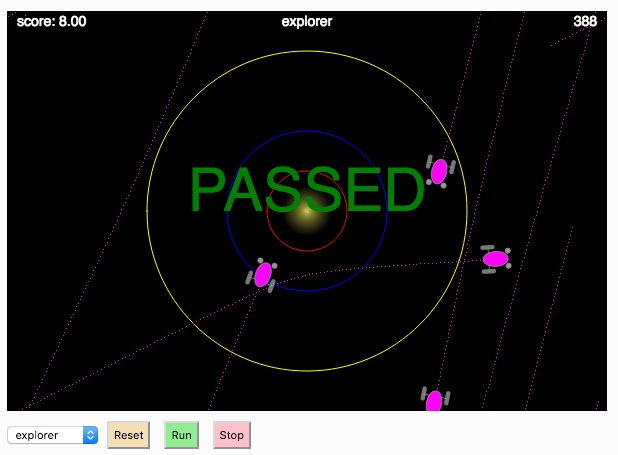

# MCB 419 - HW05 - Braitenberg vehicles
due Tue Feb 19, 2019, 9:00 PM  
email p5js project link to mcb419@gmail.com

## Introduction
In this assignment you will explore different types of Braitenberg vehicles. 
The simulation environment has been provided for you. 
The only thing that you will need to change is the controller code for the different behaviors (aggressive, coward, explorer, love).
The goal is to understand how the controller architecture (crossed vs. uncrossed, excitatory vs. inhibitory) and parameters (gain and offset) influence the observed behaviors.

## Description

The bots have two light sensors (snsL, snsR) and two motors (mtrL, mtrR).
Sensor activation follows an inverse-square law. 
Motor activation corresponds to wheel velocity in pixels per tick.

Your controller code in Bot.js should have the following form:

    this.mtrL = OFFSET + GAIN * this.sns(L/R)
    this.mtrR = OFFSET + GAIN * this.sns(L/R) 

where OFFSET and GAIN are constant values. OFFSET must be positive. GAIN can be positive (excitatory) or negative (inhibitory). You should hardcode GAIN and OFFSET as numeric values, you don't need to create variables using those names.

The OFFSET determines the motor speed with no sensor input (e.g., when the bot is infinitely far from all light sources). 
The GAIN determines how strongly the sensors influence the motors. 

Your controller code should not manipulate any other bot parameters. 
You should use the sensor values to set the motor values, and nothing more. The base code will take care of everything else. (The base code limits the overall bot speed to 5 pixels/tick, and the overall turning rate to 0.1 radians/tick.)

Each controller should use just 2 lines of code, as shown above.
You cannot use "if" statements in your code!
Each controller must agree with Braitenberg's description of the architecture (crossed vs. uncrossed, excitation vs. inhibition)

The base code will automatically score the behavior as "PASSED" or "FAILED", based on criteria that must be met in the first 1000 ticks of the simulation. Detailed scoring criteria can be found in the World.js file. 

## Instructions
- **duplicate** the [HW05 template file](https://editor.p5js.org/mcb419/sketches/n-_4VeKXx)
- **modify code as described above**
- **follow instructions** in the index.html file  
- **SAVE your project in the p5js editor**  
- **submit the url** to mcb419@gmail.com with **subject: HW05**

## -- End of assignment --