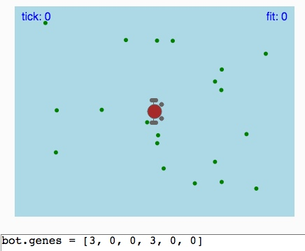

# MCB 419 - HW06 - Evolve Braitenberg
due Tue Feb 26, 2019, 9:00 PM  
email p5js project link to mcb419@gmail.com

## Introduction

In this assignment, you will evolve Braitenberg controllers that use up to 6 genes:

    mtrL = genes[0] + genes[1] * snsL + genes[2] * snsR;
    mtrR = genes[3] + genes[4] * snsL + genes[5] * snsR;
    
You will need to specify appropriate parameters in the dialog boxes 
(gene values, population size, crossover rate, mutations rate, etc.), 
but you will not have to write any new javascript code!

You can control which genes are active, and restrict their values using the lowerBound and upperBound variables. For example, setting the lowerBound and upperBound for a gene to zero, silences the gene.

## Instructions
- **duplicate** the [HW06 template file](https://editor.p5js.org/mcb419/sketches/uuNHQSp71)
- **follow instructions and answer the questions** in the index.html file  
- **save and submit your project** to mcb419@gmail.com with **subject: HW06**

## -- End of assignment --