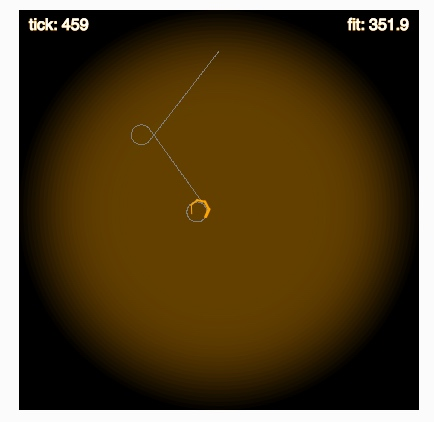

# MCB 419 - HW07 - Evolve worm controller
due Tue Mar 5, 2019, 9:00 PM  
email p5js project link to mcb419@gmail.com

## Introduction

In this assignment, you will evolve a gene-based _C. elegans_ controller that is able to function over a wide range of stimulus conditions. 
The bot variables that you will use for your controller are:

    this.sns - activation level of a chemosensory neuron (attractant concentration)
    this.v -  activation level of a sensory interneuron
    this.w - activation level of a premotor neuron that controls turning

The controller will be tested by starting the worm near the edge of the arena and seeing how efficiently it moves toward the peak. 
The fitness value is the sum of the normalized attractant concentration experienced by the worm. If the worm spends 1000 ticks at 100% of peak concentration, the fitness would be 1000. If the worm spends 1000 ticks at 50% of peak concentration, the fitness would be 500. The more time the worm spends near the peak, the higher the fitness.

The controller will be tested in three different environments (peak concentrations = 0.1, 1.0, and 10.0).
The test will consist of three trials (1000 ticks with a peak concentration of 0.1, 1000 ticks with a peak of 1.0 and 1000 ticks with a peak of 10.0). 
The worm is repositioned at the edge of the arena at the beginning of each trail. 

## Instructions
- **duplicate** the [HW07 template file](https://editor.p5js.org/mcb419/sketches/aBFk_nKDg)
- **follow instructions and answer the questions** in the index.html file  
- **save and submit your project** to mcb419@gmail.com with **subject: HW07**

## -- End of assignment --