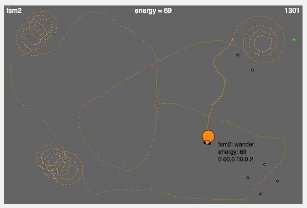

# MCB 419 - HW08 - Finite State Machine
due Tue Mar 12, 2019, 9:00 PM  
email p5js project link to mcb419@gmail.com

## Introduction

This assignment combines elements of action selection, finite-state machines (FSM), and area-restricted search (ARS) behavior. 
The goal is to develop a controller that collects as much energy as possible (100 max) in a fixed time period (2000 ticks). 
You will use an FSM controller to select among different stand-alone action patterns (behaviors) to achieve the desired performance. 

## Scenario Description
**Pellets**  
_green pellets_ - randomly distributed; can be detected at a distance; worth 1 point each; 20 pellets = 20 points  
_invisible pellets_ - clustered; can only be detected by running into them; worth 5 points each; 16 pellets = 80 points  
**Bot sensory inputs**  
_bot.sns.left, bot.sns.right_ - intensity of green pellet scent (Braitenberg-style);  
_bot.sns.collision_ - true when the bot hits a boundary; false otherwise  
_bot.sns.deltaEnergy_ - energy gained on previous time step (+1 for green pellets, +5 for invisible pellets, 0 otherwise)  
**Bot motor outputs**  
_bot.mtr.left, bot.mtr.right_ - motor velocity (Braitenberg-style)  
**Sample controllers**  
_aggressive_ - a Braitenberg crossed-excitation wiring pattern  
_spiral_ - a sample spiral (non-optimal)  
_wander_ - random wandering  
_fsm1_ - a finite-state machine that 'wanders' by default and 'spins' when it hits a boundary  
_fsm2_ - you will use this slot to implement your own controller 

## Instructions
- **duplicate** the [HW08 template file](https://editor.p5js.org/mcb419/sketches/US3ZMBRmw)
- **follow instructions and answer the questions** in the index.html file  
- **save and submit your project** to mcb419@gmail.com with **subject: HW08**

## -- End of assignment --