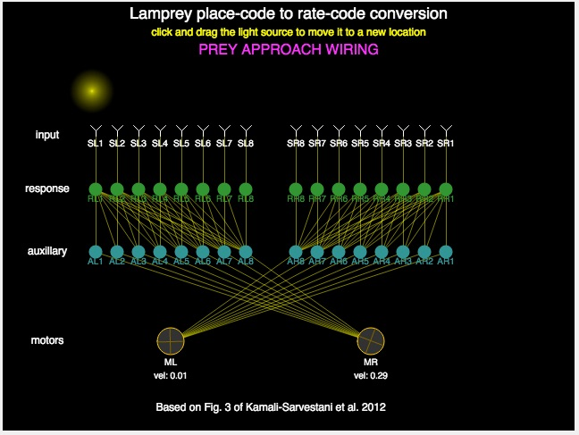

# MCB 419 - HW09 - Lamprey
due Tue  Apr 2, 2019, 9:00 PM  
email p5js project link to mcb419@gmail.com

## Introduction

This week’s homework explores the use of spike-based models in 
visuomotor circuits. You will be implementing two neural circuits for 
place-code to rate-code conversion from Fig. 3 of the paper by
[Kamali-Sarvestani et al. 2012](https://www.life.illinois.edu/mcb/419/pdf/Sarvestani12_lamprey.pdf).

## Instructions
- **duplicate** the [HW09 template file](https://editor.p5js.org/mcb419/sketches/sPN5Yokyj)
- **follow instructions** in the index.html file  
- **save and submit your project** to mcb419@gmail.com with **subject: HW09**

## -- End of assignment --