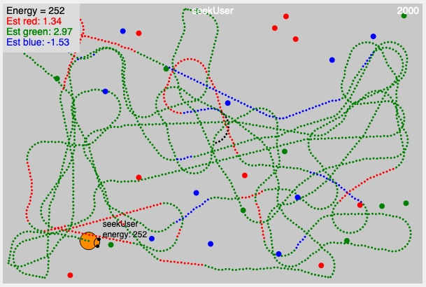

# MCB 419 - HW10 - Associative Learning
due Tue  Apr 9, 2019, 9:00 PM  
email p5js project link to mcb419@gmail.com

## Introduction
This assignment combines associative learning, estimating reward values using the delta rule, 
and implementing action policies based on estimated reward values. 
A single bot forages for colored pellets. 
Different colors have different reward values. 
The bot needs to learn the expected value of the different colors and implement an efficient foraging strategy using that information. 
The objective is to collect as much energy as possible in a fixed time period.

## Instructions
- **duplicate** the [HW10 template file](https://editor.p5js.org/mcb419/sketches/IymrC9tc2)
- **follow instructions** in the index.html file  
- **save and submit your project** to mcb419@gmail.com with **subject: HW10**

## -- End of assignment --