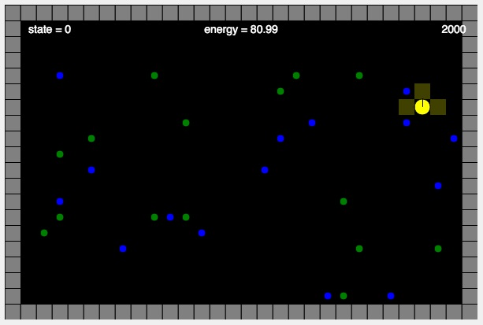

# MCB 419 - HW11 - Q-Learning
due Tue  Apr 16, 2019, 9:00 PM  
email p5js project link to mcb419@gmail.com

## Introduction
This week we will use a reinforcement learning algorithm (Q-learning) to learn an action policy for a foraging agent.
The Q-learning algorithm can be found in the lecture slides. 
The foraging task takes place in a grid world, as specified below.

**Pellets:** 15 green (good, reward = +1), 15 blue (bad, reward = -1)  
**Walls:** shown in gray; inpenetrable  
**Sensors:** the bot has 3 sensors (0 = front, 1 = left, 2 = right) indicating what is at that grid location  
**Sensor values:** 0 = nothing, 1 = wall, 2 = good pellet, 3 = bad pellet  
**Actions:** the bot has 3 actions; 0 = move forward, 1 = rotate left 90°, 2 = rotate right 90°  
**States:** correspond to possible combinations of sensor values; 
since there are 3 sensors and each sensor has 4 possible values there are 43 = 64 possible states.  
**State index:** the state index (0-63) is computed as 16\*sensor[2] + 4\*sensor[1] + sensor[0]  
**Q[state][action]:** a 64x3 array for storing learned action values; indexed by state (0-63) and action (0-2)   

## Instructions
- **duplicate** the [HW11 template file](https://editor.p5js.org/mcb419/sketches/B23TlyAJq)
- **follow instructions** in the index.html file  
- **save and submit your project** to mcb419@gmail.com with **subject: HW11**

## -- End of assignment --