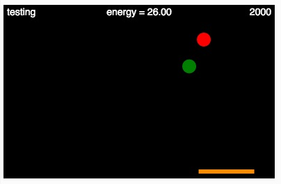

# MCB 419 - HW12 - Neural Q-Learning
due Tue  Apr 30, 2019, 9:00 PM  
email p5js project link to mcb419@gmail.com

## Introduction
This week we combine reinforcement learning with neural networks.
For this exercise, we will use a simple video game scenario, 
where the goal is to move a paddle left and right catch green pellets and avoid red pellets.

The important changes relative to hw11 are:
- the state space is now continuous, rather than discrete
- Q-values are estimated using a neural network, rather than a table

 We follow the general approach given in this week's reading assignment:
  <a href="http://www.life.illinois.edu/mcb/419/pdf/Mnih15_529-533.pdf">
    Mnih V, et al. (2015) Human Level Control Through Deep Reinforcement Learning. Nature 518, 539-533</a>.

 We will use the neural net library and reinforcement learning module documented here:
    <a href="http://cs.stanford.edu/people/karpathy/convnetjs/demo/rldemo.html">ConvNetJS: Deep Q Learning Demo</a>

## Instructions
- **duplicate** the [HW12 template file](https://editor.p5js.org/mcb419/sketches/hBqYq1tFg)
- **follow instructions** in the index.html file  
- **save and submit your project** to mcb419@gmail.com with **subject: HW12**

## -- End of assignment --